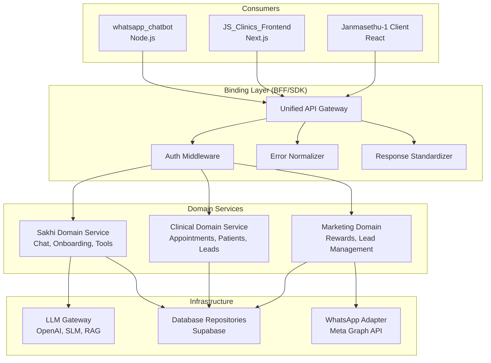

# Janmasethu Ecosystem — Exhaustive Folder-by-Folder Architectural Audit

> **Scope**: Every folder and source file across all 6 workspaces.
> **Method**: Recursive directory scan → file-level classification → layer violation analysis.
> **Date**: 2026-02-13

---

## 1. Executive Summary

The Janmasethu ecosystem spans **6 workspaces** containing **~98 directories** and **~300+ source files** (excluding `node_modules`, `__pycache__`, `.git`, `.venv`). Logic is distributed across four major subsystems:

| Subsystem | Workspace(s) | Primary Tech |
|---|---|---|
| AI Patient Companion | `Sakhi_Webapp_Backend` | FastAPI + OpenAI |
| WhatsApp Channels | `Whatsapp_backend`, `whatsapp_chatbot` | FastAPI + Node.js |
| Clinical Operations | `JS_Clinics_Backend`, `JS_Clinics_Frontend` | Next.js (App Router) |
| Platform Core | `Janmasethu-1` | Express.js monorepo + React client |

**Current State**: No explicit Binding Layer exists. Coordination logic is scattered across controllers, API routes, and frontend service files. Business rules leak into UI components and API routes. Database logic is duplicated across services.

---

## 2. Business Logic Documentation

### 2.1 — `Sakhi_Webapp_Backend/modules/`

| File | Function/Class | Responsibility | Layer |
|---|---|---|---|
| `tools.py` | `calculate_due_date` | Pregnancy due date calculation (LMP + 280 days) | **Business** |
| `tools.py` | `calculate_baby_cost` | India-specific maternity cost engine (city tier, hospital type) | **Business** |
| `tools.py` | `get_vaccination_schedule` | Vaccination schedule builder from DOB | **Business** |
| `tools.py` | `calculate_ovulation` | Ovulation/fertile window prediction | **Business** |
| `tools.py` | `check_safety` | Food/medication safety lookup for pregnancy | **Business** |
| `tools.py` | `get_readiness_checklist` | Readiness checklist for parenthood | **Business** |
| `tools.py` | `check_pregnancy_probability` | "Am I Pregnant?" scoring algorithm | **Business** |
| `tools.py` | `calculate_conception_date` | Conception window estimator | **Business** |
| `onboarding_config.py` | (Data Constants) | Relationship tree + question path definitions per relation type | **Business** |
| `onboarding_engine.py` | `get_next_question` | Stateless onboarding flow — next question based on step + answers | **Business** |
| `response_builder.py` | `classify_message` | Domain intent classification (IVF/Fertility vs General) via LLM | **Business** (domain interpretation) |
| `response_builder.py` | `CLASSIFIER_PROMPT` | Prompt construction for intent detection | **Business** (prompt engineering) |
| `response_builder.py` | `generate_smalltalk_response` | Non-medical warm/empathetic response persona | **Business** (persona rules) |
| `response_builder.py` | `generate_medical_response` | Medical RAG response with Sakhi persona + follow-ups | **Business** (persona rules) |
| `response_builder.py` | `generate_intent` | Dynamic empathetic intent sentence for patient-facing display | **Business** |
| `response_builder.py` | `_friendly_name` | Name sanitization rule (max 14 chars, filter "null"/"test") | **Business** |
| `sakhi_prompt.py` | `build_sakhi_prompt` | Full prompt construction: persona + safety + RAG + history | **Business** (prompt engineering) |
| `story_generator.py` | `constrain_summary` | Business rule: success story summary must be 6–12 words | **Business** |
| `story_generator.py` | `build_narrative_prompt` | Prompt template for IVF journey story generation | **Business** (prompt engineering) |
| `story_generator.py` | `fallback_narrative` | Deterministic fallback story when LLM fails | **Business** |
| `story_generator.py` | `ensure_narrative` | Validation gate: prefer LLM, fallback if too short/missing | **Business** |
| `text_utils.py` | `truncate_response` | Response length constraint (max 2000 chars) | **Business** |
| `preprocessing.py` | (various) | Input sanitization, normalization | **Business** |
| `parent_profiles.py` | (various) | Parent-specific profile rules | **Business** |
| `user_answers.py` | (various) | Onboarding answer persistence rules | **Business** |

### 2.2 — `Whatsapp_backend/modules/`

| File | Function/Class | Responsibility | Layer |
|---|---|---|---|
| `guardrails.py` | `UserIntent` (enum) | Intent categories: MEDICAL_FERTILITY, PREGNANCY, POSTPARTUM, EMOTIONAL, CLINIC, GREETING, OUT_OF_SCOPE | **Business** |
| `guardrails.py` | `IntentDetector` | Keyword-based intent classification (fertility, pregnancy, postpartum keywords) | **Business** |
| `guardrails.py` | `ScopeGuardrails` | Scope management system prompts per intent category | **Business** (prompt engineering) |
| `guardrails.py` | `OutputCleanup` | Regex-based LLM output sanitization (remove "As an AI…", "OpenAI") | **Business** |
| `guardrails.py` | `SakhiGuardrails` | Main guardrails interface combining intent + scope + cleanup | **Business** |
| `detect_lang.py` | `detect_language` | Telugu/Tinglish/English detection using Unicode ranges + grammar markers | **Business** |
| `detect_lang.py` | `has_telugu_unicode` | Telugu Unicode character detection (0x0C00–0x0C7F) | **Business** |
| `detect_lang.py` | `has_telugu_grammar` | Telugu grammar marker matching | **Business** |
| `user_rewards.py` | `award_points` | Points-policy logic for user engagement rewards | **Business** |
| `sakhi_prompt.py` | (various) | Prompt construction for WhatsApp channel | **Business** (prompt engineering) |
| `preprocessing.py` | (various) | WhatsApp-specific input normalization | **Business** |

### 2.3 — `whatsapp_chatbot/`

| File | Function/Class | Responsibility | Layer |
|---|---|---|---|
| `controllers/messageController.js` | `extractMessageInfo` | WhatsApp webhook payload parsing rules | **Business** (protocol-specific) |
| `controllers/messageController.js` | "Follow ups :" parser | Parsing structured LLM response format for follow-up questions | **Business** (domain interpretation of LLM output) |
| `config/whatsapp.js` | `TOPIC_MENU_ROWS` | Topic menu configuration for IVF/Fertility/Parenthood… | **Business** |
| `config/whatsapp.js` | `shouldSendAsLinkPreview` | URL classification rule (YouTube, Instagram → link preview) | **Business** |
| `config/whatsapp.js` | `normalisePreviewLink` | YouTube URL normalization (shorts → watch, youtu.be → youtube.com) | **Business** |
| `config/whatsapp.js` | `normaliseImageForWhatsApp` | Image size constraint (5MB limit, progressive JPEG compression) | **Business** |
| `config/whatsapp.js` | `splitTextIntoChunks` | WhatsApp 4096-char message splitting with smart breaks | **Business** |

### 2.4 — `JS_Clinics_Backend/lib/`

| File | Function/Class | Responsibility | Layer |
|---|---|---|---|
| `auth.ts` | `validateSession` | JWT token verification + user extraction | **Business** |
| `encryption.ts` | `encrypt` / `decrypt` | AES-256-GCM encryption/decryption for PII | **Business** (security) |
| `utils.ts` | `generateUhid` | UHID generation rule: `JAN-{year}-{seq}` | **Business** |
| `utils.ts` | `sanitizePayload` | Remove `undefined` fields from DB payloads | **Business** |
| `utils.ts` | `backfillPatientSnapshot` | Patient snapshot backfill logic for appointments | **Business** |
| `internal-assistant/intent.ts` | `IntentClassifier.classify` | LLM-based intent classification for clinic assistant (GPT-4o) | **Business** (domain interpretation of LLM output) |
| `internal-assistant/gatekeeper.ts` | `Gatekeeper.authorize` | Role-based access control per intent | **Business** |
| `internal-assistant/config.ts` | `INTENT_CONFIG` | Intent definitions, descriptions, and allowed roles | **Business** |
| `internal-assistant/types.ts` | `Intent`, `Role` | Type definitions for assistant intents and roles | **Business** |

### 2.5 — `JS_Clinics_Frontend/components/`

| File | Function/Class | Responsibility | Layer |
|---|---|---|---|
| `PatientProfile.tsx` | `handleSaveDemographics` | **⚠️ VIOLATION**: Inline validation + data mapping for patient records inside 825-line UI component | **Business** (misplaced in UI) |
| `PatientProfile.tsx` | `handleBookAppointment` | **⚠️ VIOLATION**: Appointment booking orchestration inside UI | **Coordination** (misplaced in UI) |
| `AppointmentModals.tsx` | (various) | Appointment form validation rules | **Business** (misplaced in UI) |
| `LeadsView.tsx` | (various) | Lead filtering/sorting rules | **Business** (misplaced in UI) |
| `ControlTower.tsx` | (various) | Dashboard aggregation display | **UI** |
| `internal-assistant/InternalAssistant.tsx` | (various) | Chat UI for internal assistant | **UI** |

### 2.6 — `Janmasethu-1/server/`

| File | Function/Class | Responsibility | Layer |
|---|---|---|---|
| `scraper/doctorSanitizer.ts` | `stripAppointment` | HTML sanitization rules: remove booking forms from scraped pages | **Business** |
| `scraper/medcyDoctors.ts` | `runMedcyDoctorsScrape` | Doctor data extraction rules from external websites | **Business** |
| `scraper/doctors.ts` | (various) | Doctor scraping entry points | **Business** |
| `scraper/medcy.ts` | (various) | Medcy-specific scraping rules | **Business** |

### 2.7 — `Janmasethu-1/client/src/components/tools/`

| File | Responsibility | Layer |
|---|---|---|
| `DueDateCalculator.tsx` | UI for due date calculation | **UI** |
| `OvulationCalculator.tsx` | UI for ovulation prediction | **UI** |
| `VaccinationScheduler.tsx` | UI for vaccination schedule | **UI** |
| `BabyCostCalculator.tsx` | UI for baby cost estimator | **UI** |
| `SafetyChecker.tsx` | UI for food/medication safety | **UI** |
| `ReadinessChecklist.tsx` | UI for readiness checklist | **UI** |
| `AmIPregnant.tsx` | UI for pregnancy probability | **UI** |
| `ConceptionDateCalculator.tsx` | UI for conception date | **UI** |
| `PregnancyWeekByWeek.tsx` | UI for week-by-week pregnancy tracker | **UI** |
| `ToolsLayout.tsx` | Tools page layout/routing | **UI** |

---

## 3. Database Logic Documentation

### 3.1 — Schema Definitions

| File | Responsibility | Layer |
|---|---|---|
| `Janmasethu-1/shared/schema.ts` | Drizzle ORM table definitions: `users`, `leads`, `chatMessages` | **Database** (Schema) |
| `Janmasethu-1/server/db.ts` | PostgreSQL connection pool + Drizzle initialization | **Database** (Infrastructure) |
| `Sakhi_Webapp_Backend/supabase_client.py` | Supabase client init + `supabase_select`, `supabase_insert`, `supabase_update`, `supabase_rpc` helpers | **Database** (Repository) |
| `Whatsapp_backend/supabase_client.py` | Supabase client init + CRUD helpers (same pattern as Sakhi) | **Database** (Repository) |
| `JS_Clinics_Backend/lib/supabase.ts` | Supabase Admin client configuration | **Database** (Infrastructure) |

### 3.2 — Repository / Persistence Logic

| File | Responsibility | Layer |
|---|---|---|
| `Sakhi_Webapp_Backend/modules/user_profile.py` | Patient profile CRUD (create, get, update, resolve by phone) | **Database** (Repository) |
| `Sakhi_Webapp_Backend/modules/conversation.py` | Chat message persistence + history retrieval | **Database** (Repository) |
| `Sakhi_Webapp_Backend/modules/user_answers.py` | Onboarding answer persistence | **Database** (Repository) |
| `Whatsapp_backend/modules/user_profile.py` | WhatsApp user profile persistence | **Database** (Repository) |
| `Whatsapp_backend/modules/conversation.py` | WhatsApp conversation history persistence | **Database** (Repository) |
| `Whatsapp_backend/modules/user_rewards.py` | Rewards points persistence (read/write) | **Database** (Repository) |
| `Whatsapp_backend/modules/lead_manager.py` | `_save_lead_to_db` — Lead insertion to `sakhi_clinic_leads` | **Database** (Repository) |
| `Whatsapp_backend/modules/lead_manager.py` | `_get_chat_state` / `_update_chat_state` — Chat state CRUD on `sakhi_chat_states` | **Database** (Repository) |
| `Janmasethu-1/server/storage.ts` | `IStorage` interface + `MemStorage` (in-memory user/message CRUD) | **Database** (Repository) |
| `JS_Clinics_Backend/lib/internal-assistant/data-fetcher.ts` | `DataFetcher` — Supabase queries for leads, appointments, waiting patients, clinic summary | **Database** (Repository) |

### 3.3 — SQL Migrations

| File | Responsibility | Layer |
|---|---|---|
| `Whatsapp_backend/sql/setup_hierarchical_rag.sql` | RAG tables + vector search functions | **Database** (Migration) |
| `Whatsapp_backend/sql/setup_leads.sql` | Leads table setup | **Database** (Migration) |
| `Whatsapp_backend/sql/setup_leads_strict.sql` | Strict leads constraints | **Database** (Migration) |
| `Whatsapp_backend/sql/setup_onboarding.sql` | Onboarding tables setup | **Database** (Migration) |
| `Whatsapp_backend/sql/setup_rewards.sql` | Rewards system tables | **Database** (Migration) |
| `Whatsapp_backend/sql/update_faq_rpc.sql` | FAQ RPC function update | **Database** (Migration) |
| `Sakhi_Webapp_Backend/setup_hierarchical_rag.sql` | Hierarchical RAG tables + vector functions | **Database** (Migration) |
| `Sakhi_Webapp_Backend/setup_onboarding.sql` | Onboarding tables | **Database** (Migration) |
| `Sakhi_Webapp_Backend/update_faq_rpc.sql` | FAQ RPC update | **Database** (Migration) |
| `Sakhi_Webapp_Backend/add_journey_fields.sql` | Journey-related columns | **Database** (Migration) |
| `Sakhi_Webapp_Backend/add_other_relationship_type.sql` | Relationship type column | **Database** (Migration) |

### 3.4 — Database Logic in API Routes (JS_Clinics_Backend)

| File | Responsibility | Layer |
|---|---|---|
| `app/api/appointments/route.ts` | Appointment CRUD (list, create) | **Database** (direct in route) |
| `app/api/appointments/[id]/route.ts` | Single appointment read/update | **Database** (direct in route) |
| `app/api/appointments/[id]/status/route.ts` | Appointment status update | **Database** (direct in route) |
| `app/api/auth/login/route.ts` | User login query + JWT generation | **Database** + **Business** |
| `app/api/control-tower/metrics/route.ts` | Daily appointment metrics aggregation | **Database** (direct in route) |
| `app/api/control-tower/activity/route.ts` | Activity log query | **Database** (direct in route) |
| `app/api/control-tower/alerts/route.ts` | Alert query logic | **Database** (direct in route) |
| `app/api/control-tower/doctor-utilization/route.ts` | Doctor utilization metrics | **Database** (direct in route) |
| `app/api/control-tower/flow/route.ts` | Patient flow data | **Database** (direct in route) |
| `app/api/control-tower/lead-summary/route.ts` | Lead summary aggregation | **Database** (direct in route) |
| `app/api/control-tower/live-queue/route.ts` | Live queue status | **Database** (direct in route) |
| `app/api/control-tower/patient-flow-summary/route.ts` | Patient flow summary | **Database** (direct in route) |
| `app/api/control-tower/utilization/route.ts` | Staff utilization metrics | **Database** (direct in route) |
| `app/api/control-tower/waiting-alerts/route.ts` | Waiting time alerts | **Database** (direct in route) |
| `app/api/dashboard/summary/route.ts` | Dashboard summary query | **Database** (direct in route) |
| `app/api/dashboard/cro/route.ts` | CRO dashboard query | **Database** (direct in route) |
| `app/api/leads/route.ts` | Lead CRUD | **Database** (direct in route) |
| `app/api/leads/[id]/route.ts` | Single lead operations | **Database** (direct in route) |
| `app/api/leads/[id]/re-engage/route.ts` | Lead re-engagement update | **Database** (direct in route) |
| `app/api/leads/bulk/route.ts` | Bulk lead operations | **Database** (direct in route) |
| `app/api/leads/export/route.ts` | Lead data export | **Database** (direct in route) |
| `app/api/patients/route.ts` | Patient CRUD | **Database** (direct in route) |
| `app/api/patients/[id]/route.ts` | Single patient operations | **Database** (direct in route) |
| `app/api/patients/[id]/appointments/route.ts` | Patient appointment history | **Database** (direct in route) |
| `app/api/patients/[id]/clinical-notes/route.ts` | Clinical notes CRUD | **Database** (direct in route) |
| `app/api/patients/[id]/documents/route.ts` | Patient document storage | **Database** (direct in route) |
| `app/api/patients/[id]/notes/route.ts` | Patient notes CRUD | **Database** (direct in route) |
| `app/api/knowledge/articles/route.ts` | Knowledge article queries | **Database** (direct in route) |
| `app/api/internal-assistant/chat/route.ts` | Internal assistant chat entry point | **Coordination** (direct in route) |

---

## 4. Coordination Logic Documentation

### 4.1 — Primary Orchestrators

| File | Why It Is Coordination | Layer |
|---|---|---|
| `Janmasethu-1/server/routes.ts` | **God Route (~1500 lines)**: Auth → Scraping → AI Chat → Storage → Response in a single file. Orchestrates all server-side flows for the monorepo. | **Coordination** |
| `Sakhi_Webapp_Backend/main.py` | **Central Orchestrator**: Resolves user profile → classifies message → decides LLM route → generates response → saves conversation → returns reply | **Coordination** |
| `Whatsapp_backend/main.py` | **WhatsApp-Sakhi Bridge**: Receives WA messages → resolves user → runs guardrails → calls Sakhi modules → builds WA response → sends via Graph API | **Coordination** |
| `whatsapp_chatbot/controllers/messageController.js` | **WA Webhook Handler**: Extracts WA event → calls Support API → parses structured response → sends multi-part WA messages | **Coordination** |
| `whatsapp_chatbot/index.js` | Express app bootstrap, webhook route registration | **Coordination** (infrastructure) |

### 4.2 — LLM Orchestration

| File | Why It Is Coordination | Layer |
|---|---|---|
| `Sakhi_Webapp_Backend/modules/model_gateway.py` | **Semantic Router**: Generates query embedding → cosine similarity against anchors → routes to SLM_DIRECT / SLM_RAG / OPENAI_RAG | **Coordination** (LLM routing) |
| `Sakhi_Webapp_Backend/modules/slm_client.py` | **SLM Gateway**: HTTP client to external SLM endpoints (Groq/vLLM), singleton pattern | **Coordination** (LLM calling) |
| `Sakhi_Webapp_Backend/modules/rag_search.py` | **RAG Orchestrator**: Generate embedding → query `match_sakhi_kb` + `match_faq` RPCs → merge + sort results | **Coordination** (multi-source search) |
| `Sakhi_Webapp_Backend/search_hierarchical.py` | **Hierarchical RAG**: Multi-level vector search orchestration | **Coordination** (multi-source search) |
| `Whatsapp_backend/modules/model_gateway.py` | Same semantic routing for WhatsApp channel | **Coordination** (LLM routing) |
| `Whatsapp_backend/modules/translation_service.py` | **Translation Orchestrator**: OpenAI call for Telugu → English translation before routing | **Coordination** (LLM calling) |
| `Whatsapp_backend/modules/slm_client.py` | SLM gateway for WhatsApp channel | **Coordination** (LLM calling) |
| `Whatsapp_backend/modules/rag_search.py` | RAG orchestration for WhatsApp | **Coordination** (multi-source search) |
| `Whatsapp_backend/modules/search_hierarchical.py` | Hierarchical RAG for WhatsApp | **Coordination** (multi-source search) |
| `JS_Clinics_Backend/lib/internal-assistant/responder.ts` | **Response Generator**: Takes intent + data → constructs system prompt → calls GPT-4o → returns natural language response | **Coordination** (LLM calling) |
| `JS_Clinics_Backend/lib/internal-assistant/index.ts` | **Assistant Pipeline**: Intent classify → Gatekeeper → DataFetcher → Responder → Audit Log | **Coordination** (pipeline orchestration) |

### 4.3 — Multi-Service / Multi-Step Orchestration

| File | Why It Is Coordination | Layer |
|---|---|---|
| `Sakhi_Webapp_Backend/modules/story_generator.py` | `process_new_story`: Generate narrative via LLM → validate → fallback → update Supabase | **Coordination** |
| `Whatsapp_backend/modules/lead_manager.py` | `handle_lead_flow`: Multi-step state machine for lead data collection over WhatsApp messages | **Coordination** |
| `config/whatsapp.js` | `sendMessage` → `buildOutboundPayload` → `expandPayloadIfNeeded` → `postWhatsAppMessage`: Multi-step WA message dispatch | **Coordination** |
| `config/whatsapp.js` | `uploadExternalImageAsMedia`: Download image → optimize → upload to Meta Media API → return ID | **Coordination** |

### 4.4 — Frontend Service / API Layer

| File | Why It Is Coordination | Layer |
|---|---|---|
| `JS_Clinics_Frontend/services/api.ts` | **Frontend API Client**: Auth token management + typed fetch wrapper + error normalization for all backend calls | **Coordination** |
| `Janmasethu-1/client/src/api/toolsApi.ts` | **Tools API Client**: Typed client for all medical tools (vaccination, due date, ovulation, etc.) calling Sakhi backend | **Coordination** |
| `Janmasethu-1/client/src/contexts/` | React contexts for state sharing across components | **Coordination** (state management) |
| `Janmasethu-1/client/src/hooks/` | Custom React hooks for data fetching/state | **Coordination** (state management) |

### 4.5 — Scripts & DevOps

| File | Responsibility | Layer |
|---|---|---|
| `Sakhi_Webapp_Backend/ingest_hierarchical.py` | Knowledge base ingestion pipeline | **Coordination** (data pipeline) |
| `Sakhi_Webapp_Backend/ingest_json.py` | JSON data ingestion | **Coordination** (data pipeline) |
| `Sakhi_Webapp_Backend/backfill_embeddings.py` | Embedding backfill for existing KB entries | **Coordination** (data pipeline) |
| `Whatsapp_backend/scripts/send_marketing_messages.py` | Bulk WhatsApp marketing message dispatch | **Coordination** (batch job) |
| `Whatsapp_backend/scripts/ingest_hierarchical.py` | KB ingestion for WhatsApp | **Coordination** (data pipeline) |
| `Whatsapp_backend/scripts/diagnose_llm_failures.py` | LLM failure debugging utility | **Coordination** (diagnostics) |
| `Whatsapp_backend/scripts/terminal_chat.py` | Terminal-based chat testing | **Coordination** (testing) |
| `Whatsapp_backend/scripts/verify_telugu_output.py` | Telugu output verification | **Coordination** (testing) |

---

## 5. Infrastructure / UI-Only Folders (No Business Logic)

| Folder | Contents | Classification |
|---|---|---|
| `JS_Clinics_Frontend/public/` | Static assets (images) | **Infrastructure** |
| `JS_Clinics_Frontend/components/landing/` | Landing page UI components | **UI** |
| `JS_Clinics_Frontend/components/landing/mockups/` | Design mockups | **UI** |
| `Janmasethu-1/client/public/` | Static public assets | **Infrastructure** |
| `Janmasethu-1/client/public/JS slides/` | Presentation slides | **Documentation** |
| `Janmasethu-1/client/public/KnowledgeHub/` | Knowledge Hub static content | **Documentation** |
| `Janmasethu-1/client/public/locales/` | i18n translation files | **Infrastructure** |
| `Janmasethu-1/client/public/treatments/` | Treatment info static content | **Documentation** |
| `Janmasethu-1/client/src/i18n/` | i18n configuration | **Infrastructure** |
| `Janmasethu-1/client/src/lib/` | Utility functions | **Infrastructure** |
| `Janmasethu-1/client/src/utils/` | Helper utilities | **Infrastructure** |
| `Janmasethu-1/client/src/components/ui/` | Shadcn/Radix UI primitives (~50 files) | **UI** (library) |
| `Janmasethu-1/client/src/components/home/` | Home page sections (FAQ, Journey, Knowledge, Tools previews) | **UI** |
| `Janmasethu-1/client/src/components/clinic/` | Clinic-specific UI components | **UI** |
| `Janmasethu-1/client/src/pages/` | Page-level React components | **UI** |
| `Janmasethu-1/client/src/pages/clinic/` | Clinic-specific pages | **UI** |
| `Janmasethu-1/client/src/data/` | Static data files | **Infrastructure** |
| `Janmasethu-1/client/src/data/clinic/` | Clinic-specific static data | **Infrastructure** |
| `Janmasethu-1/attached_assets/` | Attached image/media assets | **Infrastructure** |
| `Janmasethu-1/server/orchestrators/` | **Empty** — placeholder for future orchestrators | **Infrastructure** (unused) |
| `Janmasethu-1/server/repositories/` | **Empty** — placeholder for future repositories | **Infrastructure** (unused) |
| `Janmasethu-1/server/services/` | **Empty** — placeholder for future services | **Infrastructure** (unused) |
| `Janmasethu-1/shared/` | Shared schema + types | **Database** (already classified) |
| `*/doc/`, `*/docs/` | Documentation folders across workspaces | **Documentation** |
| `Janmasethu-1/documents/` | Generated documentation | **Documentation** |
| `Whatsapp_backend/data/` | Data files | **Infrastructure** |
| `Whatsapp_backend/logs/` | Log output files | **Infrastructure** |
| `Whatsapp_backend/tests/` | 16 test files (unit, integration, load tests) | **Testing** |
| `whatsapp_chatbot/docs/` | Chatbot documentation | **Documentation** |
| `JS_Clinics_Backend/doc/`, `JS_Clinics_Backend/docs/` | Backend documentation | **Documentation** |
| `JS_Clinics_Frontend/doc/` | Frontend documentation | **Documentation** |
| `Janmasethu-1/doc/`, `Janmasethu-1/docs/` | Monorepo documentation | **Documentation** |
| `Sakhi_Webapp_Backend/doc/` | Sakhi documentation | **Documentation** |
| `Whatsapp_backend/doc/`, `Whatsapp_backend/docs/` | WhatsApp backend documentation | **Documentation** |

---

## 6. Layer Violations Found

### Violation 1: God Route — `Janmasethu-1/server/routes.ts`
- **Problem**: ~1500-line file mixing Auth, Scraping, AI Chat, Database insertion, and Response formatting.
- **What belongs where**:
  - Auth → Business Layer (`auth.ts`)
  - Scraper orchestration → Coordination Layer
  - AI chat response → Business Layer (prompt rules) + Coordination Layer (LLM calls)
  - DB inserts → Database Layer (Repository)
- **Why misplaced**: Single-file monolith prevents independent testing and reuse.

### Violation 2: Fat Frontend Component — `JS_Clinics_Frontend/components/PatientProfile.tsx`
- **Problem**: 825-line UI component containing `handleSaveDemographics` (inline validation + data mapping), `handleBookAppointment` (multi-step API orchestration), `fetchPatientDetails`, `fetchClinicalNotes`.
- **What belongs where**:
  - Validation/mapping → Business Layer (domain service)
  - Multi-step API calls → Coordination Layer (service class)
- **Why misplaced**: UI components should only render and dispatch; business logic embedded here cannot be reused by other views or tested independently.

### Violation 3: Direct DB in API Routes — `JS_Clinics_Backend/app/api/**`
- **Problem**: All 28 API routes contain direct Supabase queries with no Repository abstraction. Metrics aggregation logic lives in route handlers.
- **What belongs where**:
  - SQL queries → Database Layer (`repositories/`)
  - Metrics computation → Business Layer (`services/analytics.ts`)
- **Why misplaced**: Route files should only handle HTTP request/response. Current pattern makes it impossible to reuse query logic across routes.

### Violation 4: Leaky Format Parsing — `whatsapp_chatbot/controllers/messageController.js`
- **Problem**: The controller parses " Follow ups : " string patterns from LLM responses and constructs WhatsApp interactive button payloads inline.
- **What belongs where**:
  - Parsing LLM response structure → Business Layer (response parser)
  - WhatsApp payload construction → Coordination Layer (WA adapter)
- **Why misplaced**: If the LLM prompt format changes, the chatbot controller must also change — tight coupling across service boundary.

### Violation 5: Mixed Responsibilities — `Sakhi_Webapp_Backend/modules/response_builder.py`
- **Problem**: This single file handles prompt construction (Business), LLM API calls (Coordination), response truncation (Business), and KB search integration (Coordination).
- **What belongs where**:
  - Prompt templates → Business Layer (prompt engineering)
  - OpenAI API calls → Coordination Layer (LLM gateway)
  - Response truncation → Business Layer
- **Why misplaced**: Business rules for prompt construction are entangled with the mechanics of calling OpenAI, making it hard to swap LLM providers.

### Violation 6: Mixed Responsibilities — `Whatsapp_backend/modules/lead_manager.py`
- **Problem**: State machine logic (Business), DB state reads/writes (Database), and multi-step flow control (Coordination) all in one file.
- **What belongs where**:
  - State machine transitions → Business Layer
  - DB CRUD → Database Layer (Repository)
  - Flow orchestration → Coordination Layer
- **Why misplaced**: Cannot test state machine logic independently of database calls.

### Violation 7: Duplicated Modules Across Services
- **Problem**: `model_gateway.py`, `slm_client.py`, `rag_search.py`, `preprocessing.py`, `sakhi_prompt.py`, `conversation.py`, `user_profile.py` each exist in BOTH `Sakhi_Webapp_Backend/modules/` AND `Whatsapp_backend/modules/`.
- **What belongs where**: These should exist ONCE in a shared package or Binding Layer.
- **Why misplaced**: Changes to business rules must be synchronized manually across two codebases.

---

## 7. Recommendation for Extracting Binding Layer

### 7.1 — Proposed Architecture

### 7.2 — Extraction Priorities

| Priority | Action | Impact |
|---|---|---|
| **P0** | Extract shared modules (`model_gateway`, `rag_search`, `slm_client`, `user_profile`, `conversation`) into a single `janmasethu-core` package | Eliminates code duplication across Sakhi + WhatsApp backends |
| **P1** | Create Repository layer in `JS_Clinics_Backend` (move all Supabase queries out of routes) | Enables query reuse + independent testing |
| **P2** | Standardize response format: `{ reply, intent, follow_ups[], media? }` | Decouples consumers from LLM output format |
| **P3** | Extract `PatientProfile.tsx` orchestration into `services/patientService.ts` | Clean UI / business separation |
| **P4** | Decompose `routes.ts` God Route into orchestrator + domain services | Makes monorepo maintainable |
| **P5** | Centralize auth (JWT validation + Supabase session) into Binding Layer middleware | Single auth implementation across all consumers |
